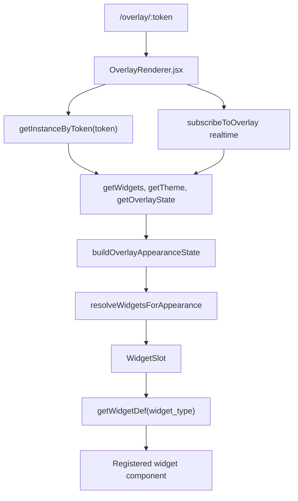
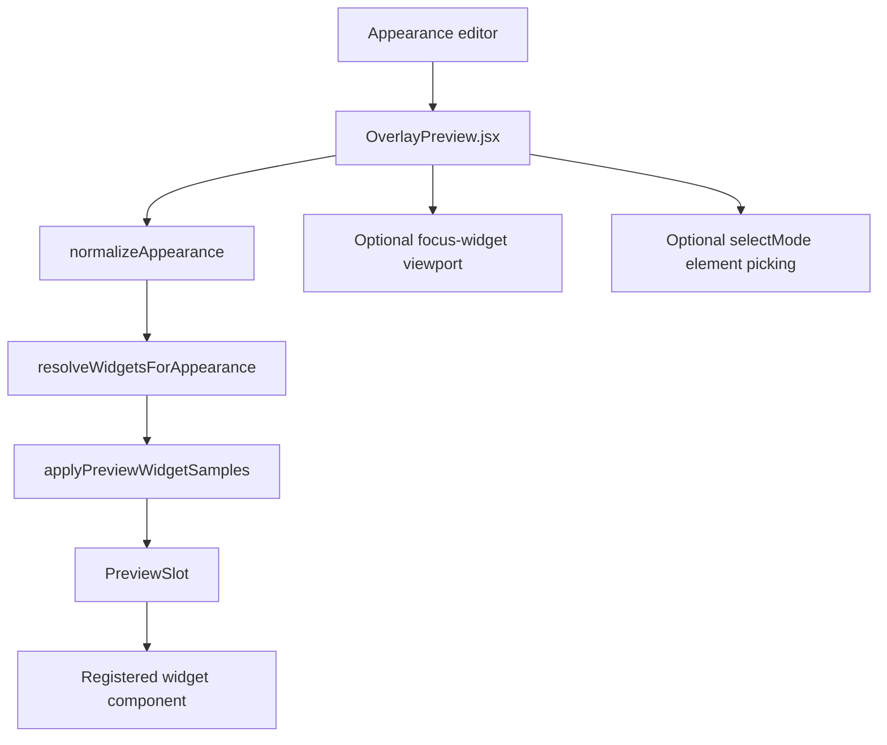
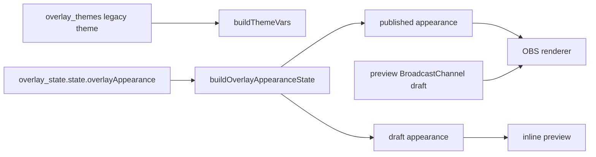

# Rendering Architecture

## OBS rendering flow

Primary files:

- `src/App.jsx:369`
- `src/components/OverlayCenter/OverlayRenderer.jsx`
- `src/services/overlayService.js`
- `src/components/OverlayCenter/widgets/builtinWidgets.js`
- `src/components/OverlayCenter/themeVarsBuilder.js`
- `src/components/OverlayCenter/appearance/appearanceModel.js`

## Widget slot responsibilities

`WidgetSlot` in `OverlayRenderer.jsx:55` owns the renderer shell around every widget:

- Resolves the registry component from `getWidgetDef`.
- Applies absolute position, width, height, z-index, animation class, canvas fill behavior for background widgets, and slot-level overflow behavior.
- Builds widget CSS variables with `buildWidgetAppearanceVars(config)`.
- Applies `custom_css`, `advancedCSS`, and scoped `elementCSS`.
- Applies slot-level `drop-shadow` using `shadowSize` and `shadowIntensity`.
- Applies inner clipping when `cardRadius` is configured and the widget does not require visible overflow.

The shell is not presentation-neutral. Any future appearance system must treat slot-level sizing, overflow, clipping, radius, and animation as first-class properties.

## Preview rendering flow

The inline preview intentionally reuses registered widget components, but it is not the same runtime as OBS:

- It is embedded inside the admin page DOM.
- It can expand frames and inject sample data.
- It can focus a single widget while still rendering other visible widgets dimmed.
- It can add selection outlines for elements with `data-widget-element`.
- It does not use the OBS route's enter/exit animation wrapper in the same way.

## Appearance state flow

Important source facts:

- `OverlayRenderer.jsx` uses published appearance for normal OBS and draft appearance for `?preview=1`.
- Pop-out preview can receive draft data via `BroadcastChannel('streamers-center-preview')`.
- `overlay_themes` still feeds legacy CSS variables and must not be removed abruptly.
- `overlay_state` is the correct place for versioned appearance state.

## CSS variable layers

Current renderer variables come from multiple sources:

1. Legacy theme variables from `themeVarsBuilder.js` (`--oc-*`, `--t-*`).
2. Modern overlay variables from `themeVarsBuilder.js` (`--overlay-*`).
3. Slot/widget variables from `buildWidgetAppearanceVars`.
4. Widget-specific variables inside widget components or `OverlayRenderer.css`.
5. User-provided `custom_css`, `advancedCSS`, and `elementCSS`.

This order is not fully formalized. The registry phase should define an explicit cascade:

1. Widget defaults.
2. Global appearance tokens.
3. Widget appearance tokens.
4. Element group tokens.
5. State-specific tokens.
6. Individual overrides.
7. Safe custom CSS where supported.

## Realtime paths

`overlayService.subscribeToOverlay` subscribes to overlay runtime changes for widgets, themes, and state. Several widget components also subscribe to their own data sources:

- `slot_requests` for Slot Requests and Bonus Hunt V12 request views.
- `detected_slots` and `slots` for active slot/RTP flows.
- External chat/stream services for Chat, Navbar, Spotify, and Raid Shoutout.

The appearance editor must not change business logic data flow. It should only write appearance-compatible config/state.
